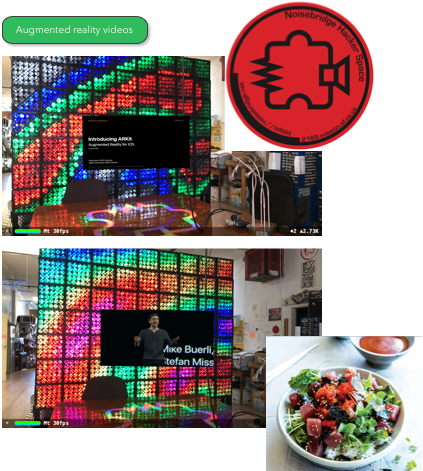
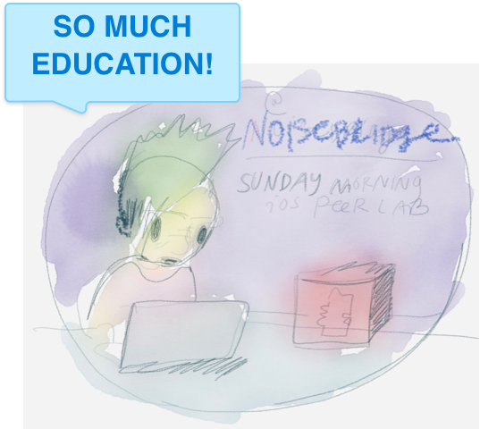

#  Hacking a video at Noisebridge iOS Sunday Morning

# Code

Stick a video in augmented reality on the iphone at noisebridge.

This is hacker code, not unit-tested or original :)

* From Apple template code and tutorial by Andrew Turkin. Thanks dude! [link](https://github.com/AndrewTurkin/ARKitVideo.git)

# IOS PEER LAB SUNDAZE

